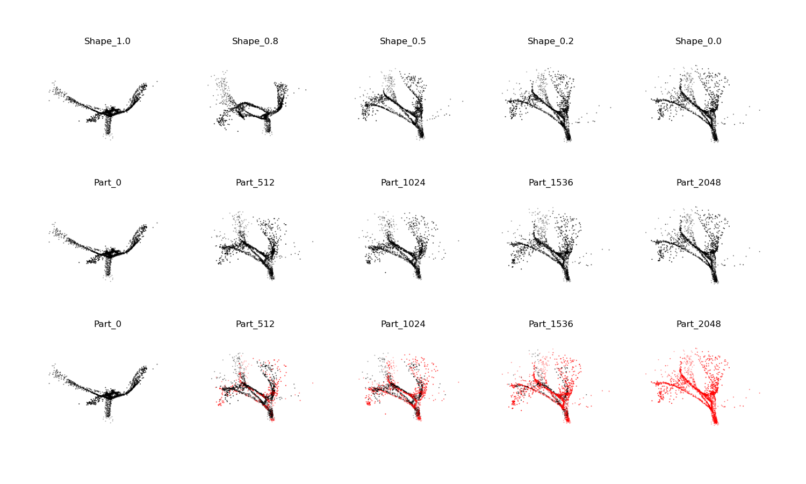
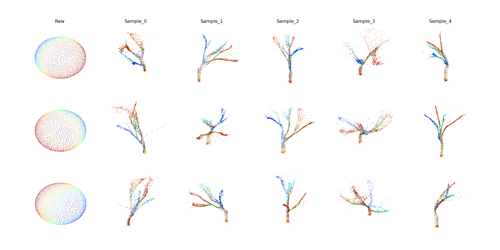

## Overview
<a target="_blank" href="https://github.com/anc2001/SP-GAN"> Github Link</a>

A dataset of procedurally generated trees was created with the blender addon [Treegen](https://github.com/friggog/tree-gen). These trees were then converted into point clouds with Poisson disk sampling. The model [SP-GAN](https://github.com/liruihui/SP-GAN) was trained for 300 epochs on this point cloud data. 

## Results
Latent Space Interpolation

SP-GAN morphs a sphere of points into the final pointcloud. Correspondence between points on the starting sphere and the final pointcloud is shown below. 

