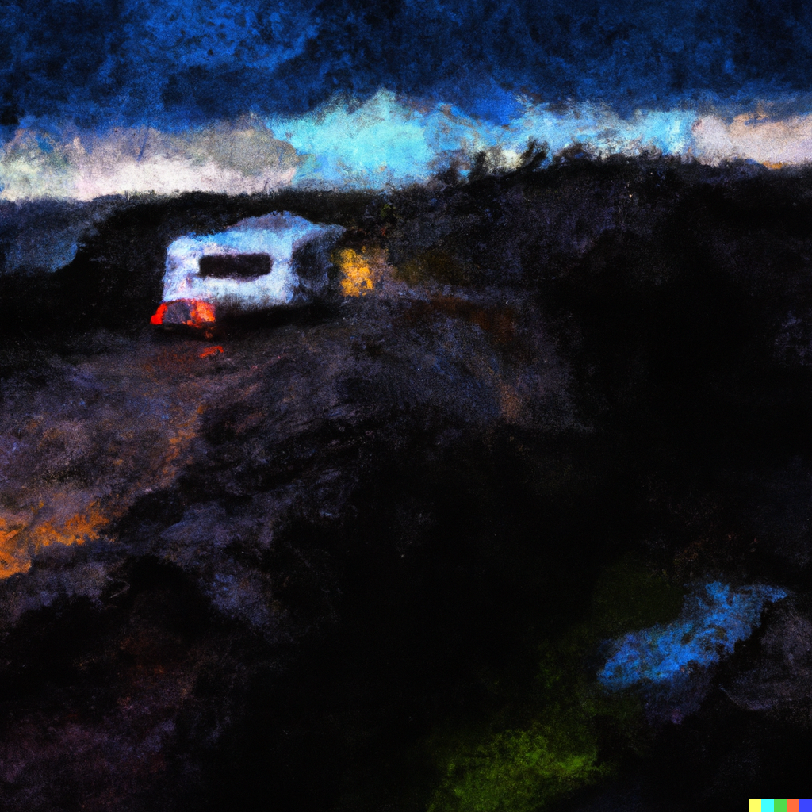

In my sophomore summer I took a trip to Iceland. It was a road trip around the country: just me and a good friend driving a camper van from campsite to campsite. This was my first experience driving stick shift in a place other than a parking lot. I found myself driving in the dead of night. The black waters and crawling mountainside flew by as I sped into the night. I was hyper focused. I needed to be locked in, or the grim night would pull my eyelids shut. Japanese indie rock blasted inside the car as I zipped up and down the Fjords. The thrill of circumstance slowly bled away and I felt cold again. A naked man appeared next to me, sprinting and keeping pace. I blinked and he was gone. My dashboard blinked telling me the back door was open. I pulled over and closed the doors. I did not tell my friend. 